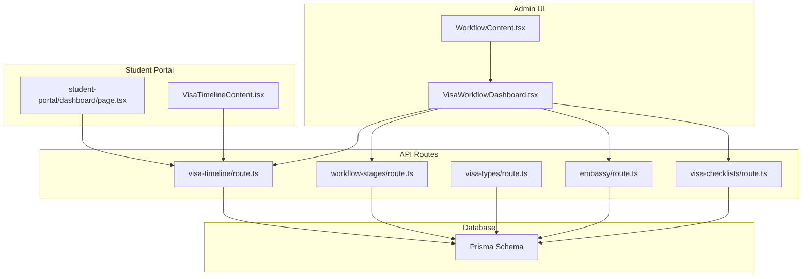
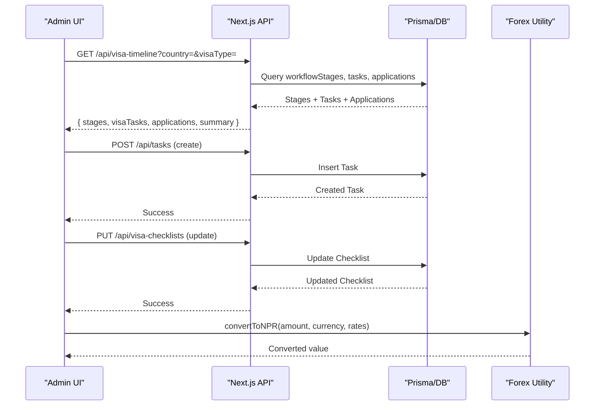
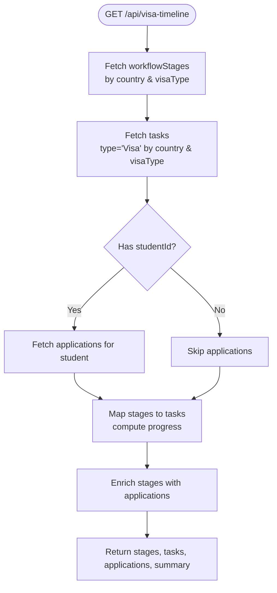
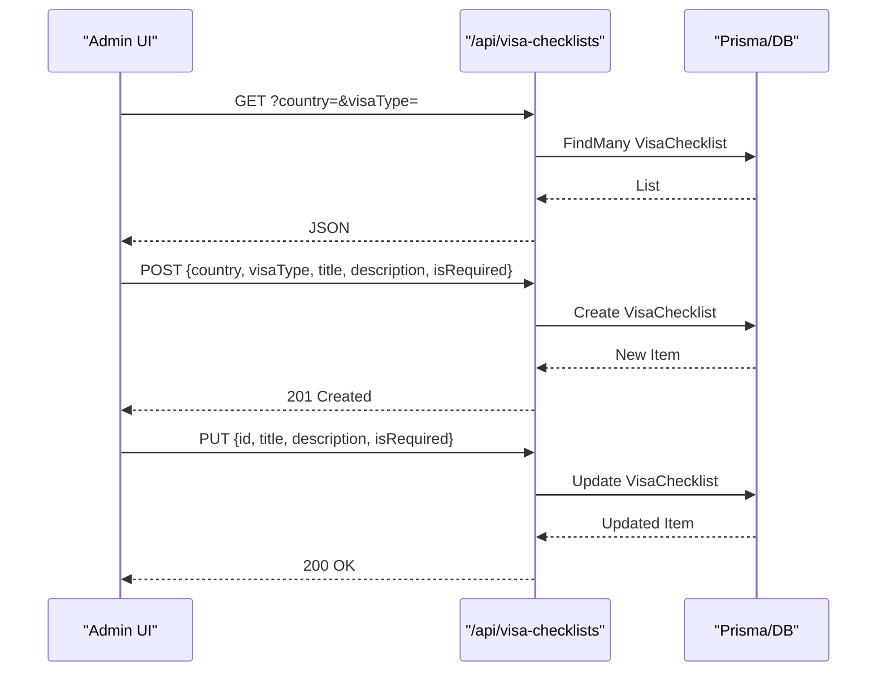
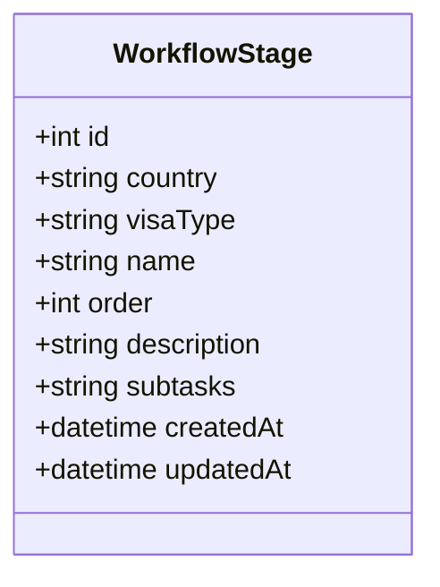
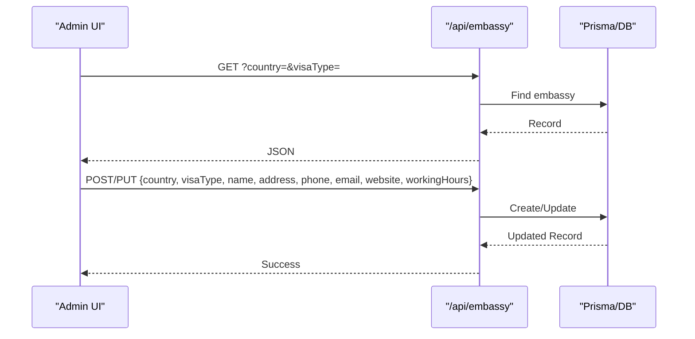
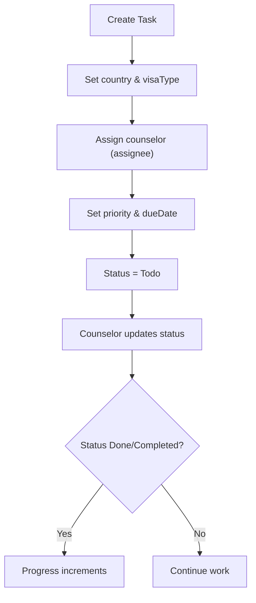
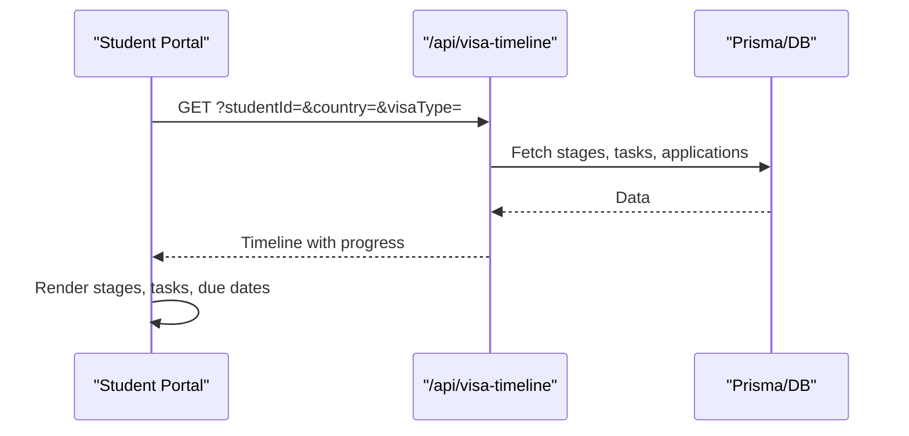
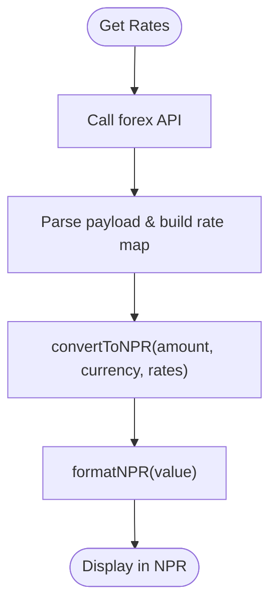
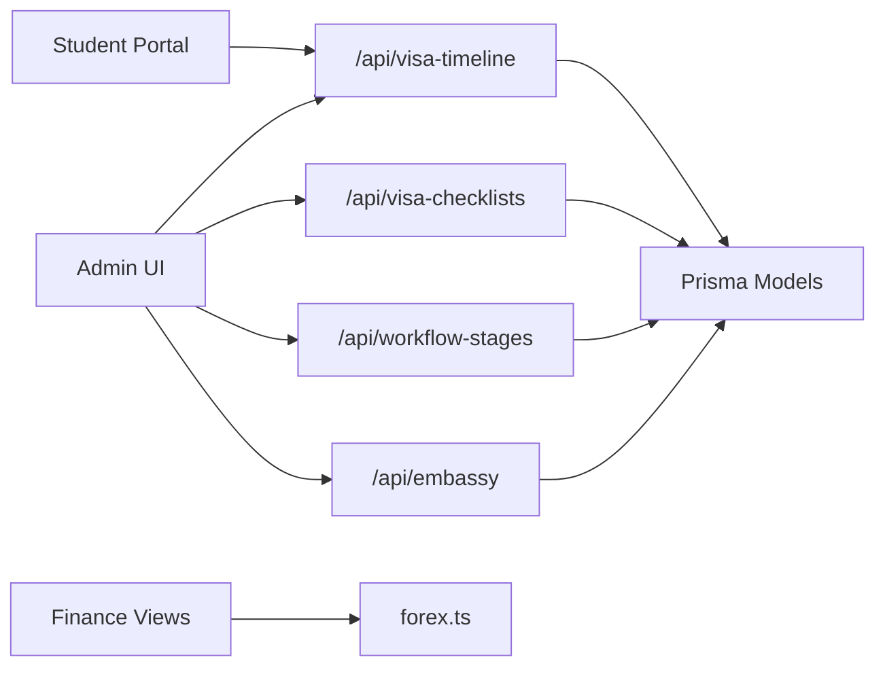

# Visa Processing Workflow

<cite>
**Referenced Files in This Document**
- [route.ts](file://src/app/api/visa-timeline/route.ts)
- [route.ts](file://src/app/api/visa-checklists/route.ts)
- [route.ts](file://src/app/api/visa-types/route.ts)
- [route.ts](file://src/app/api/workflow-stages/route.ts)
- [route.ts](file://src/app/api/embassy/route.ts)
- [schema.prisma](file://prisma/schema.prisma)
- [VisaWorkflowDashboard.tsx](file://src/app/tasks/components/VisaWorkflowDashboard.tsx)
- [WorkflowContent.tsx](file://src/app/tasks/components/WorkflowContent.tsx)
- [page.tsx](file://src/app/tasks/page.tsx)
- [VisaTimelineContent.tsx](file://src/app/visa-timeline/VisaTimelineContent.tsx)
- [page.tsx](file://src/app/student-portal/dashboard/page.tsx)
- [forex.ts](file://src/lib/forex.ts)
</cite>

## Table of Contents
1. [Introduction](#introduction)
2. [Project Structure](#project-structure)
3. [Core Components](#core-components)
4. [Architecture Overview](#architecture-overview)
5. [Detailed Component Analysis](#detailed-component-analysis)
6. [Dependency Analysis](#dependency-analysis)
7. [Performance Considerations](#performance-considerations)
8. [Troubleshooting Guide](#troubleshooting-guide)
9. [Conclusion](#conclusion)
10. [Appendices](#appendices)

## Introduction
This document explains the Visa Processing Workflow for automated visa application management and deadline tracking. It covers country-specific requirements, document preparation workflows, automated deadline monitoring, embassy integration, task assignment to counselors, approval flows, multi-country support, currency conversion for fees, compliance tracking via audit logs, and reporting capabilities. The system is built on Next.js API routes with a Prisma-backed database and client-side dashboards for administrators and students.

## Project Structure
The visa workflow spans several modules:
- Admin workflow configuration (countries, visa types, stages)
- Task management and assignment
- Embassy details per country and visa type
- Visa checklists per country and visa type
- Timeline aggregation and progress calculation
- Student portal visibility of visa timelines
- Currency conversion utilities for fee display
- Audit logging for compliance

**Diagram sources**
- [route.ts:1-116](file://src/app/api/visa-timeline/route.ts#L1-L116)
- [route.ts:1-128](file://src/app/api/visa-checklists/route.ts#L1-L128)
- [route.ts:1-119](file://src/app/api/visa-types/route.ts#L1-L119)
- [route.ts:1-131](file://src/app/api/workflow-stages/route.ts#L1-L131)
- [route.ts:41-85](file://src/app/api/embassy/route.ts#L41-L85)
- [schema.prisma:587-629](file://prisma/schema.prisma#L587-L629)
- [VisaWorkflowDashboard.tsx:94-200](file://src/app/tasks/components/VisaWorkflowDashboard.tsx#L94-L200)
- [WorkflowContent.tsx:98-160](file://src/app/tasks/components/WorkflowContent.tsx#L98-L160)
- [page.tsx:174-295](file://src/app/student-portal/dashboard/page.tsx#L174-L295)
- [VisaTimelineContent.tsx:21-73](file://src/app/visa-timeline/VisaTimelineContent.tsx#L21-L73)

**Section sources**
- [page.tsx:1-15](file://src/app/tasks/page.tsx#L1-L15)
- [schema.prisma:522-629](file://prisma/schema.prisma#L522-L629)

## Core Components
- Visa Types: Centralized list of visa categories used across workflows.
- Workflow Stages: Ordered steps per country and visa type that define process phases.
- Tasks: Action items tied to country and visa type, with assignees, due dates, priorities, and statuses.
- Embassy Details: Contact and operational info per country and visa type.
- Visa Checklists: Country- and visa-type-specific document requirements.
- Timeline Aggregation: Computes stage-level progress and overall completion from tasks.
- Student Portal View: Displays visa timeline and tasks for a student’s interested country.
- Forex Utilities: Converts foreign currency fees to NPR for consistent reporting and display.

Key responsibilities:
- Configuration: Create/update/delete visa types, workflow stages, embassy details, and checklists.
- Execution: Create tasks, assign to counselors, set due dates, update status.
- Monitoring: Aggregate progress, highlight active stage, show overdue or upcoming deadlines.
- Reporting: Export reports and track changes via audit logs.

**Section sources**
- [route.ts:1-119](file://src/app/api/visa-types/route.ts#L1-L119)
- [route.ts:1-131](file://src/app/api/workflow-stages/route.ts#L1-L131)
- [route.ts:1-128](file://src/app/api/visa-checklists/route.ts#L1-L128)
- [route.ts:41-85](file://src/app/api/embassy/route.ts#L41-L85)
- [route.ts:1-116](file://src/app/api/visa-timeline/route.ts#L1-L116)
- [VisaWorkflowDashboard.tsx:94-200](file://src/app/tasks/components/VisaWorkflowDashboard.tsx#L94-L200)
- [forex.ts:27-77](file://src/lib/forex.ts#L27-L77)

## Architecture Overview
The system uses a layered architecture:
- Client UIs: Admin workflow dashboard and student portal.
- API Layer: REST endpoints for CRUD operations and aggregated data.
- Data Layer: Prisma models for entities like Task, WorkflowStage, VisaChecklist, EmbassyDetail, VisaType.
- Utilities: Forex conversion for currency display and formatting.

**Diagram sources**
- [route.ts:1-116](file://src/app/api/visa-timeline/route.ts#L1-L116)
- [route.ts:1-128](file://src/app/api/visa-checklists/route.ts#L1-L128)
- [forex.ts:27-77](file://src/lib/forex.ts#L27-L77)

## Detailed Component Analysis

### Visa Timeline Aggregation
Purpose:
- Compute per-stage progress based on related tasks.
- Identify the active stage by finding the last stage with non-completed tasks.
- Enrich stages with applications relevant to the country.

Data flow:
- Fetches workflow stages filtered by country and visa type.
- Fetches tasks of type “Visa” filtered by country and visa type.
- Optionally fetches applications for a student to enrich stage views.
- Calculates completed tasks and percentage progress per stage.
- Returns summary metrics: total stages, completed stages, overall progress.

**Diagram sources**
- [route.ts:1-116](file://src/app/api/visa-timeline/route.ts#L1-L116)

**Section sources**
- [route.ts:1-116](file://src/app/api/visa-timeline/route.ts#L1-L116)

### Visa Checklists Management
Purpose:
- Define required and optional documents per country and visa type.
- Support creation, updates, and deletion with activity logging.

Operations:
- GET: Retrieve checklists by country and visa type.
- POST: Create checklist item with title, description, and isRequired flag.
- PUT: Update existing checklist item fields.
- DELETE: Remove checklist item with audit log.

**Diagram sources**
- [route.ts:1-128](file://src/app/api/visa-checklists/route.ts#L1-L128)

**Section sources**
- [route.ts:1-128](file://src/app/api/visa-checklists/route.ts#L1-L128)

### Workflow Stages Configuration
Purpose:
- Define ordered stages per country and visa type with optional subtasks.
- Enable stepwise processing and tracking.

Operations:
- GET: Retrieve stages by country and visa type, ordered.
- POST: Create stage with name, order, description, and subtasks (JSON).
- PATCH: Update stage fields including subtasks.
- DELETE: Remove stage with audit log.

**Diagram sources**
- [schema.prisma:619-629](file://prisma/schema.prisma#L619-L629)

**Section sources**
- [route.ts:1-131](file://src/app/api/workflow-stages/route.ts#L1-L131)
- [schema.prisma:619-629](file://prisma/schema.prisma#L619-L629)

### Embassy Integration
Purpose:
- Store and manage embassy/consulate details per country and visa type.
- Provide contact information and working hours for counselors and applicants.

Operations:
- GET: Retrieve embassy detail by country and visa type.
- POST/PUT: Create or update embassy record; log activity with diff.
- DELETE: Remove embassy record with audit log.

**Diagram sources**
- [route.ts:41-85](file://src/app/api/embassy/route.ts#L41-L85)

**Section sources**
- [route.ts:41-85](file://src/app/api/embassy/route.ts#L41-L85)
- [schema.prisma:594-606](file://prisma/schema.prisma#L594-L606)

### Task Assignment and Deadline Tracking
Purpose:
- Assign visa-related tasks to counselors with due dates and priorities.
- Track status progression and completion percentages.

Key features:
- Tasks are linked to country and visa type for filtering.
- Status values include Todo, In Progress, Review, Done.
- Due dates enable deadline monitoring and reminders.
- Assignee field links to users for accountability.

**Diagram sources**
- [schema.prisma:522-538](file://prisma/schema.prisma#L522-L538)

**Section sources**
- [schema.prisma:522-538](file://prisma/schema.prisma#L522-L538)

### Student Portal Visibility
Purpose:
- Show students their visa workflow progress for their interested country.
- Display stage icons, colors, and task lists with due dates.

Behavior:
- Loads timeline stages and tasks via API.
- Highlights active stage and completed stages.
- Shows overall progress percentage and stage counts.

**Diagram sources**
- [route.ts:1-116](file://src/app/api/visa-timeline/route.ts#L1-L116)
- [page.tsx:174-295](file://src/app/student-portal/dashboard/page.tsx#L174-L295)
- [VisaTimelineContent.tsx:21-73](file://src/app/visa-timeline/VisaTimelineContent.tsx#L21-L73)

**Section sources**
- [page.tsx:174-295](file://src/app/student-portal/dashboard/page.tsx#L174-L295)
- [VisaTimelineContent.tsx:21-73](file://src/app/visa-timeline/VisaTimelineContent.tsx#L21-L73)

### Currency Conversion for Fees
Purpose:
- Convert tuition and other fees from foreign currencies to NPR for consistent display and reporting.

Mechanism:
- Fetch latest exchange rates from an external forex API.
- Use sell rate for conversions.
- Format amounts in NPR using locale-aware formatter.

**Diagram sources**
- [forex.ts:27-77](file://src/lib/forex.ts#L27-L77)

**Section sources**
- [forex.ts:27-77](file://src/lib/forex.ts#L27-L77)

## Dependency Analysis
Core dependencies and relationships:
- Admin UI depends on API routes for all CRUD operations and aggregated timeline data.
- API routes depend on Prisma models for data persistence and querying.
- Student portal depends on timeline API for progress visualization.
- Forex utility is independent but consumed by finance-related displays.

**Diagram sources**
- [route.ts:1-116](file://src/app/api/visa-timeline/route.ts#L1-L116)
- [route.ts:1-128](file://src/app/api/visa-checklists/route.ts#L1-L128)
- [route.ts:1-131](file://src/app/api/workflow-stages/route.ts#L1-L131)
- [route.ts:41-85](file://src/app/api/embassy/route.ts#L41-L85)
- [forex.ts:27-77](file://src/lib/forex.ts#L27-L77)

**Section sources**
- [schema.prisma:522-629](file://prisma/schema.prisma#L522-L629)

## Performance Considerations
- Batch queries: The timeline endpoint uses parallel fetching for stages, tasks, and applications to reduce latency.
- Filtering: API routes filter by country and visa type to minimize dataset size.
- Pagination: For large datasets, consider adding pagination to tasks and applications endpoints.
- Caching: Introduce server-side caching for forex rates and static configuration (visa types, countries).
- Indexing: Ensure database indexes on frequently queried fields (country, visaType, status, dueDate).

[No sources needed since this section provides general guidance]

## Troubleshooting Guide
Common issues and resolutions:
- Missing country or visa type parameters:
  - Ensure both country and visaType are provided when calling checklists or stages APIs.
- Unauthorized access:
  - Verify session authentication for protected endpoints like timeline.
- No workflow configured:
  - If no stages exist for a country/visa type, configure them via admin UI before tasks can be tracked.
- Task not appearing:
  - Confirm task type is “Visa” and matches country/visaType filters.
- Embassy details missing:
  - Create or update embassy records for the target country and visa type.
- Forex conversion returns zero:
  - Check network connectivity to forex API and ensure currency codes are valid.

**Section sources**
- [route.ts:1-128](file://src/app/api/visa-checklists/route.ts#L1-L128)
- [route.ts:1-131](file://src/app/api/workflow-stages/route.ts#L1-L131)
- [route.ts:1-116](file://src/app/api/visa-timeline/route.ts#L1-L116)
- [forex.ts:27-77](file://src/lib/forex.ts#L27-L77)

## Conclusion
The Visa Processing Workflow provides a comprehensive framework for managing visa applications across multiple countries and visa types. It supports structured stages, actionable tasks with deadlines, embassy integration, customizable document checklists, and student-facing progress tracking. With forex conversion and audit logging, it also addresses financial transparency and compliance needs. Administrators can configure new country workflows, manage timelines, and generate reports to monitor performance and bottlenecks.

[No sources needed since this section summarizes without analyzing specific files]

## Appendices

### Configuring a New Country Workflow
Steps:
- Add the country to the workflow list via admin UI.
- Define one or more visa types if not already present.
- Create ordered workflow stages for the selected country and visa type.
- Populate embassy details for accurate applicant guidance.
- Build visa checklists specifying required and optional documents.
- Create initial tasks with due dates and assign counselors.

**Section sources**
- [WorkflowContent.tsx:98-160](file://src/app/tasks/components/WorkflowContent.tsx#L98-L160)
- [route.ts:1-131](file://src/app/api/workflow-stages/route.ts#L1-L131)
- [route.ts:1-128](file://src/app/api/visa-checklists/route.ts#L1-L128)
- [route.ts:41-85](file://src/app/api/embassy/route.ts#L41-L85)

### Managing Visa Timelines
- Use the admin dashboard to view stages, tasks, and progress.
- Filter by country and visa type to focus on specific workflows.
- Monitor overdue tasks and adjust due dates as needed.
- Leverage the student portal to share progress with applicants.

**Section sources**
- [route.ts:1-116](file://src/app/api/visa-timeline/route.ts#L1-L116)
- [VisaWorkflowDashboard.tsx:94-200](file://src/app/tasks/components/VisaWorkflowDashboard.tsx#L94-L200)
- [page.tsx:174-295](file://src/app/student-portal/dashboard/page.tsx#L174-L295)

### Generating Progress Reports
- Use the report builder to select relevant report types and date ranges.
- Export data in CSV or PDF formats for analysis and sharing.
- Combine with audit logs for compliance verification.

**Section sources**
- [ReportBuilderContent.tsx:384-517](file://src/app/reports/builder/ReportBuilderContent.tsx#L384-L517)
- [ReportsContent.tsx:41-58](file://src/app/reports/components/ReportsContent.tsx#L41-L58)