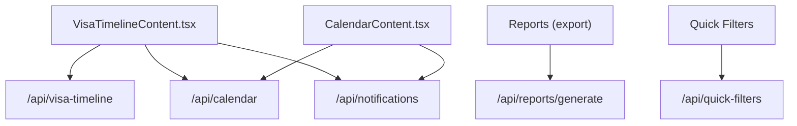
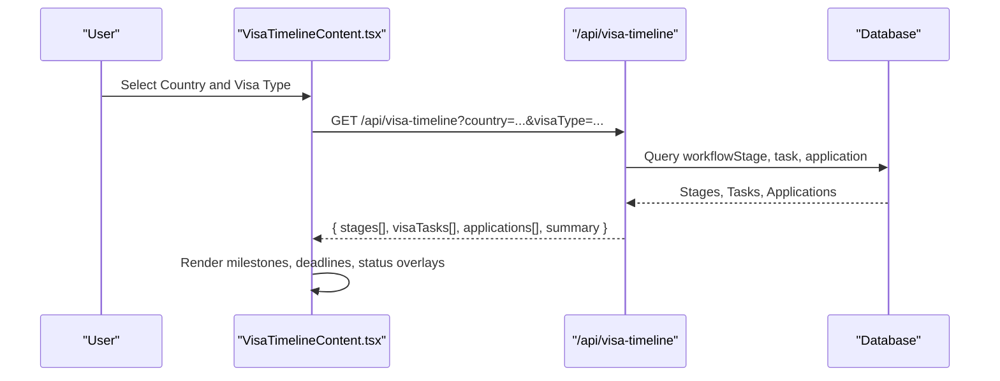
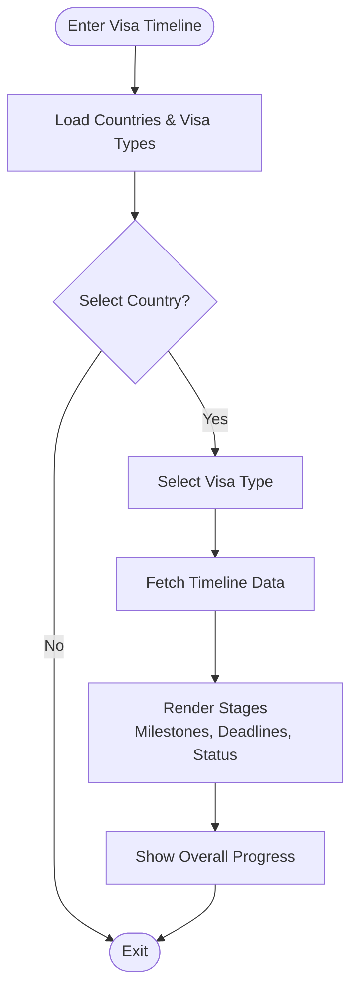
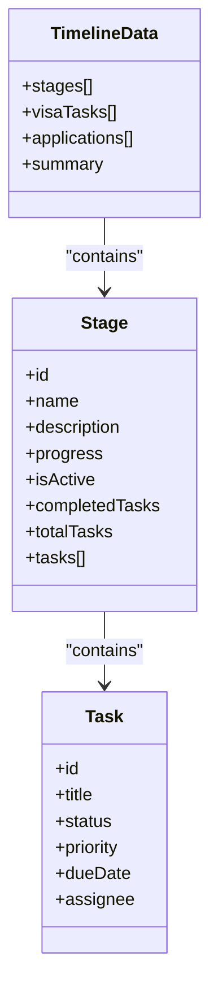
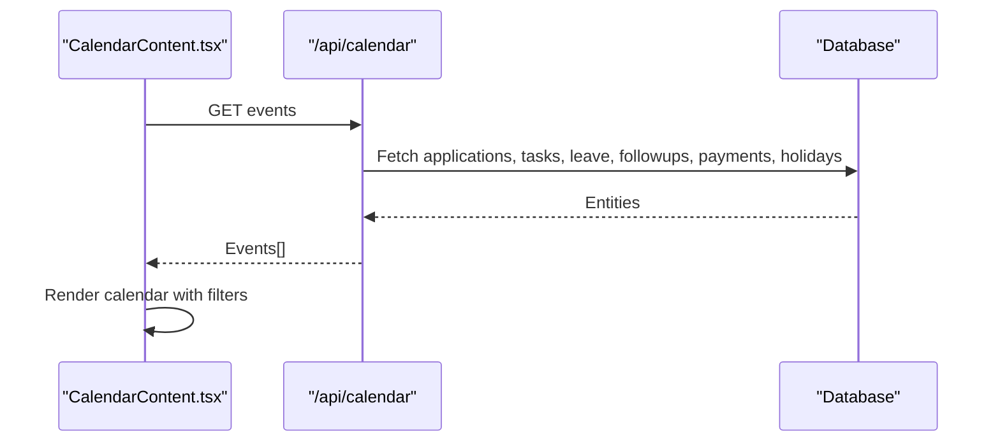
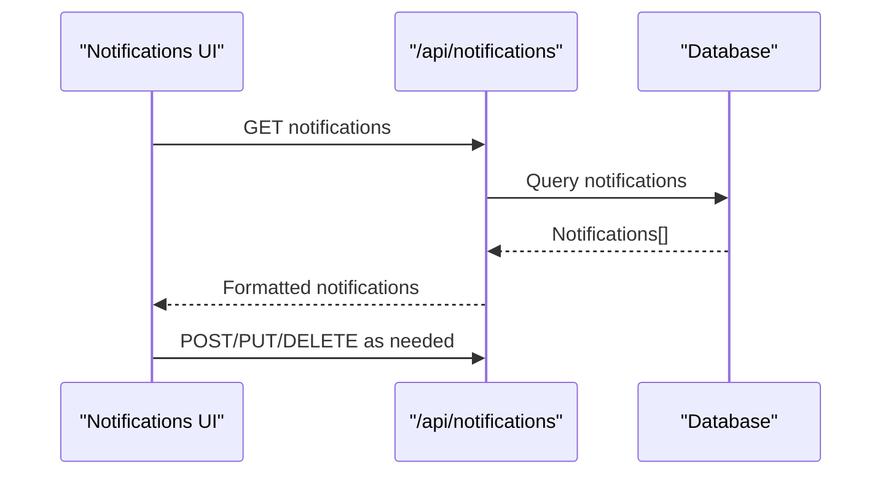
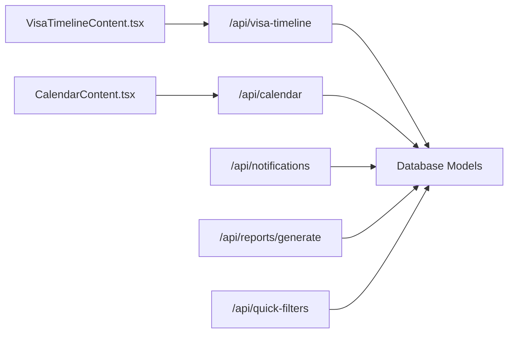

# Visa Timeline Tracking

<cite>
**Referenced Files in This Document**
- [page.tsx](file://src/app/visa-timeline/page.tsx)
- [VisaTimelineContent.tsx](file://src/app/visa-timeline/VisaTimelineContent.tsx)
- [route.ts](file://src/app/api/visa-timeline/route.ts)
- [CalendarContent.tsx](file://src/app/calendar/CalendarContent.tsx)
- [calendar route.ts](file://src/app/api/calendar/route.ts)
- [notifications route.ts](file://src/app/api/notifications/route.ts)
- [reports generate route.ts](file://src/app/api/reports/generate/route.ts)
- [quick-filters route.ts](file://src/app/api/quick-filters/route.ts)
- [application statuses.ts](file://src/lib/application-statuses.ts)
</cite>

## Table of Contents
1. [Introduction](#introduction)
2. [Project Structure](#project-structure)
3. [Core Components](#core-components)
4. [Architecture Overview](#architecture-overview)
5. [Detailed Component Analysis](#detailed-component-analysis)
6. [Dependency Analysis](#dependency-analysis)
7. [Performance Considerations](#performance-considerations)
8. [Troubleshooting Guide](#troubleshooting-guide)
9. [Conclusion](#conclusion)
10. [Appendices](#appendices)

## Introduction
This document explains the Visa Timeline Tracking system, focusing on how the visual timeline interface displays application progress across multiple visa processes simultaneously. It covers milestone markers, deadline indicators, status overlays, calendar integration for upcoming deadlines and appointments, real-time updates, filtering and search, export options, notification integrations, and performance considerations for large datasets.

## Project Structure
The Visa Timeline feature is implemented as a Next.js client component with a dedicated API route to fetch timeline data. A separate Calendar module aggregates events from applications, tasks, leave requests, follow-ups, payments, and holidays into a unified view. Notifications are managed via an API that supports listing, creating, marking read, and deleting notifications. Reports can be generated using a generic report generation endpoint. Quick filters provide reusable filter definitions.

**Diagram sources**
- [VisaTimelineContent.tsx:215-243](file://src/app/visa-timeline/VisaTimelineContent.tsx#L215-L243)
- [route.ts:6-115](file://src/app/api/visa-timeline/route.ts#L6-L115)
- [CalendarContent.tsx:66-185](file://src/app/calendar/CalendarContent.tsx#L66-L185)
- [calendar route.ts:66-129](file://src/app/api/calendar/route.ts#L66-L129)
- [notifications route.ts:18-143](file://src/app/api/notifications/route.ts#L18-L143)
- [reports generate route.ts:7-99](file://src/app/api/reports/generate/route.ts#L7-L99)
- [quick-filters route.ts:5-36](file://src/app/api/quick-filters/route.ts#L5-L36)

**Section sources**
- [page.tsx:1-14](file://src/app/visa-timeline/page.tsx#L1-L14)
- [VisaTimelineContent.tsx:1-637](file://src/app/visa-timeline/VisaTimelineContent.tsx#L1-L637)
- [route.ts:1-116](file://src/app/api/visa-timeline/route.ts#L1-L116)
- [CalendarContent.tsx:1-185](file://src/app/calendar/CalendarContent.tsx#L1-L185)
- [calendar route.ts:1-129](file://src/app/api/calendar/route.ts#L1-L129)
- [notifications route.ts:1-143](file://src/app/api/notifications/route.ts#L1-L143)
- [reports generate route.ts:1-99](file://src/app/api/reports/generate/route.ts#L1-L99)
- [quick-filters route.ts:1-36](file://src/app/api/quick-filters/route.ts#L1-L36)

## Core Components
- Visa Timeline Page: Entry point wrapping the timeline content within the app layout.
- VisaTimelineContent: Client-side component that drives the three-step flow (countries → visas → timeline), renders milestones, deadlines, and status overlays, and syncs state to URL query parameters.
- Visa Timeline API: Server route that queries workflow stages, tasks, and applications, computes per-stage progress and active stage, and returns enriched timeline data with summary metrics.
- Calendar: Aggregates events from multiple entities to show upcoming deadlines and important dates.
- Notifications API: Provides CRUD operations for notifications to support alerting and reminders.
- Reports Generation: Generic endpoint to export filtered data for reporting.
- Quick Filters: Endpoint to retrieve and manage quick filter definitions used across views.

**Section sources**
- [page.tsx:1-14](file://src/app/visa-timeline/page.tsx#L1-L14)
- [VisaTimelineContent.tsx:129-637](file://src/app/visa-timeline/VisaTimelineContent.tsx#L129-L637)
- [route.ts:6-115](file://src/app/api/visa-timeline/route.ts#L6-L115)
- [CalendarContent.tsx:66-185](file://src/app/calendar/CalendarContent.tsx#L66-L185)
- [notifications route.ts:18-143](file://src/app/api/notifications/route.ts#L18-L143)
- [reports generate route.ts:7-99](file://src/app/api/reports/generate/route.ts#L7-L99)
- [quick-filters route.ts:5-36](file://src/app/api/quick-filters/route.ts#L5-L36)

## Architecture Overview
The timeline UI navigates through countries and visa types before rendering a vertical timeline of stages. Each stage shows milestone icons, completion badges, task lists with priorities and due dates, and a progress bar. The server composes stages with related tasks and optionally enriches them with applications by country. The calendar pulls events from multiple sources to visualize upcoming deadlines and appointments. Notifications can be created and consumed to alert users about changes or upcoming deadlines.

**Diagram sources**
- [VisaTimelineContent.tsx:215-243](file://src/app/visa-timeline/VisaTimelineContent.tsx#L215-L243)
- [route.ts:21-110](file://src/app/api/visa-timeline/route.ts#L21-L110)

## Detailed Component Analysis

### Visa Timeline Content
- Three-step navigation: Countries → Visa Types → Timeline, with breadcrumbs and back buttons.
- Milestone markers: Stage nodes use icons based on progress and active state; completed stages show a checkmark, active stages show a clock, pending stages show a circle.
- Deadline indicators: Each task displays its due date when present.
- Status overlays: Per-stage badges indicate Completed, In Progress, or Pending; tasks show colored dots for Done/Completed vs In Progress vs not started.
- Progress visualization: Per-stage progress bars and overall progress summary panel.
- URL synchronization: View, country, and visa selections are reflected in query parameters for shareable links and browser history.
- Data fetching: Loads countries and visa types once; fetches timeline data when entering the timeline view with selected filters.

**Diagram sources**
- [VisaTimelineContent.tsx:215-243](file://src/app/visa-timeline/VisaTimelineContent.tsx#L215-L243)
- [VisaTimelineContent.tsx:450-618](file://src/app/visa-timeline/VisaTimelineContent.tsx#L450-L618)

**Section sources**
- [VisaTimelineContent.tsx:129-637](file://src/app/visa-timeline/VisaTimelineContent.tsx#L129-L637)

### Visa Timeline API
- Authentication: Requires a valid session; returns unauthorized if missing.
- Filtering: Supports filtering by studentId, country, and visaType.
- Data composition:
  - Retrieves workflow stages ordered by their sequence.
  - Retrieves Visa-type tasks with assignee details.
  - Optionally retrieves applications for a given student.
- Progress calculation: For each stage, counts completed tasks and computes percentage; marks the last non-completed stage as active.
- Enrichment: Associates applications with stages by matching university country to stage country.
- Response shape: Returns stages array, visaTasks, applications, and a summary including total stages, completed stages, and overall progress.

**Diagram sources**
- [route.ts:21-110](file://src/app/api/visa-timeline/route.ts#L21-L110)

**Section sources**
- [route.ts:6-115](file://src/app/api/visa-timeline/route.ts#L6-L115)

### Calendar Integration
- Event aggregation: Combines applications, tasks, leave requests, follow-ups, payments, and holidays into a unified event list.
- Visualization: Displays events in a monthly calendar with type-based color coding and filtering by event type.
- Upcoming deadlines: Tasks due dates appear as calendar events; applications and payments also surface key dates.
- Important dates: Holidays are included to mark non-working days.

**Diagram sources**
- [CalendarContent.tsx:66-185](file://src/app/calendar/CalendarContent.tsx#L66-L185)
- [calendar route.ts:66-129](file://src/app/api/calendar/route.ts#L66-L129)

**Section sources**
- [CalendarContent.tsx:1-185](file://src/app/calendar/CalendarContent.tsx#L1-L185)
- [calendar route.ts:1-129](file://src/app/api/calendar/route.ts#L1-L129)

### Notifications and Real-Time Updates
- Notification endpoints: List recent notifications, create new ones, mark as read, delete single/all.
- Real-time reflection: While polling is not explicitly shown in the timeline component, the presence of a robust notifications API enables integrating push or polling mechanisms to reflect status changes and deadline adjustments.
- Use cases: Alert staff when a task becomes overdue, when a stage completes, or when a deadline approaches.

**Diagram sources**
- [notifications route.ts:18-143](file://src/app/api/notifications/route.ts#L18-L143)

**Section sources**
- [notifications route.ts:1-143](file://src/app/api/notifications/route.ts#L1-L143)

### Filtering and Search
- Country search: Local filtering of countries by name in the timeline view.
- Quick filters: Retrieve predefined filters from the backend to standardize common views.
- Date range filters: Available in reports and audit sections; can be adapted for timeline exports.

**Section sources**
- [VisaTimelineContent.tsx:245-247](file://src/app/visa-timeline/VisaTimelineContent.tsx#L245-L247)
- [quick-filters route.ts:5-36](file://src/app/api/quick-filters/route.ts#L5-L36)

### Export Options and Timeline Reports
- Generic report generation: Supports entity-based queries with field selection and filters, returning mapped rows suitable for export.
- Timeline-specific export: Use the report generator with the Application entity and relevant fields to produce timeline-related datasets; combine with date boundaries for time-bound reports.

**Section sources**
- [reports generate route.ts:7-99](file://src/app/api/reports/generate/route.ts#L7-L99)

### Monitoring Multiple Applications and Bottlenecks
- Multi-application view: The timeline API can include applications associated with stages by country, enabling cross-application monitoring.
- Bottleneck identification: Stages with low progress relative to others indicate bottlenecks; tasks with high priority and upcoming due dates highlight urgent work.
- Status normalization: Application statuses map to process stages, aiding consistent interpretation across systems.

**Section sources**
- [route.ts:91-96](file://src/app/api/visa-timeline/route.ts#L91-L96)
- [application statuses.ts:1-44](file://src/lib/application-statuses.ts#L1-L44)

## Dependency Analysis
- Frontend dependencies:
  - VisaTimelineContent depends on Next.js routing and hooks, Lucide icons, and fetch utilities.
  - CalendarContent depends on Next.js routing and fetch utilities.
- Backend dependencies:
  - Visa timeline API depends on database models (workflowStage, task, application).
  - Calendar API depends on multiple entities (applications, tasks, leave, follow-ups, payments, holidays).
  - Notifications API depends on notification model and session verification.
  - Reports API depends on various entities and Prisma includes.
  - Quick filters depend on quickFilter model.

**Diagram sources**
- [VisaTimelineContent.tsx:215-243](file://src/app/visa-timeline/VisaTimelineContent.tsx#L215-L243)
- [route.ts:21-110](file://src/app/api/visa-timeline/route.ts#L21-L110)
- [CalendarContent.tsx:66-185](file://src/app/calendar/CalendarContent.tsx#L66-L185)
- [calendar route.ts:66-129](file://src/app/api/calendar/route.ts#L66-L129)
- [notifications route.ts:18-143](file://src/app/api/notifications/route.ts#L18-L143)
- [reports generate route.ts:7-99](file://src/app/api/reports/generate/route.ts#L7-L99)
- [quick-filters route.ts:5-36](file://src/app/api/quick-filters/route.ts#L5-L36)

**Section sources**
- [VisaTimelineContent.tsx:215-243](file://src/app/visa-timeline/VisaTimelineContent.tsx#L215-L243)
- [route.ts:21-110](file://src/app/api/visa-timeline/route.ts#L21-L110)
- [CalendarContent.tsx:66-185](file://src/app/calendar/CalendarContent.tsx#L66-L185)
- [calendar route.ts:66-129](file://src/app/api/calendar/route.ts#L66-L129)
- [notifications route.ts:18-143](file://src/app/api/notifications/route.ts#L18-L143)
- [reports generate route.ts:7-99](file://src/app/api/reports/generate/route.ts#L7-L99)
- [quick-filters route.ts:5-36](file://src/app/api/quick-filters/route.ts#L5-L36)

## Performance Considerations
- Efficient data fetching:
  - Batch queries: The timeline API uses parallel queries for stages, tasks, and applications to minimize round trips.
  - Selective includes: Only include necessary relations (e.g., assignee name) to reduce payload size.
- Rendering optimizations:
  - Conditional rendering: Loading states prevent unnecessary DOM updates during data fetches.
  - Sticky summary panel: Keeps progress visible without re-rendering the entire timeline.
- Scalability strategies:
  - Pagination: Consider adding pagination to task and application lists if datasets grow large.
  - Caching: Cache countries and visa types at the edge or via CDN to reduce repeated requests.
  - Debounced search: Implement debouncing for country search to avoid excessive re-renders.
- Calendar performance:
  - Event limits: Cap the number of events returned per month to maintain responsiveness.
  - Lazy loading: Load events for adjacent months only when navigating.

[No sources needed since this section provides general guidance]

## Troubleshooting Guide
- Unauthorized access: Ensure a valid session exists before calling protected APIs; the timeline and reports endpoints return unauthorized errors if missing.
- Missing data: If no stages or tasks are found, verify that workflow stages and tasks are configured for the selected country and visa type.
- Calendar empty: Confirm that applications, tasks, and other entities have valid dates; holidays must be added to appear.
- Notifications not updating: Check that notifications are being created and marked read correctly; ensure polling or push integration is in place if real-time updates are required.
- Export failures: Validate that entity and fields are provided to the report generation endpoint; ensure filters are well-formed.

**Section sources**
- [route.ts:8-9](file://src/app/api/visa-timeline/route.ts#L8-L9)
- [notifications route.ts:18-55](file://src/app/api/notifications/route.ts#L18-L55)
- [reports generate route.ts:12-15](file://src/app/api/reports/generate/route.ts#L12-L15)

## Conclusion
The Visa Timeline Tracking system provides a clear, interactive visualization of multi-process visa applications, highlighting milestones, deadlines, and status changes. Integrated calendar and notifications enhance awareness of upcoming work, while flexible filtering and reporting support operational insights. With careful attention to performance and scalability, the system can handle growing datasets and evolving workflows effectively.

## Appendices

### Example Workflows
- Monitoring multiple applications:
  - Select a country and visa type to view all stages and tasks.
  - Use the applications list attached to stages to identify which applications are affected by each stage.
- Identifying bottlenecks:
  - Look for stages with low progress and many incomplete tasks.
  - Prioritize tasks with High/Urgent priority and near due dates.
- Generating timeline reports:
  - Use the report generation endpoint with the Application entity and relevant fields.
  - Apply date filters to capture a specific period for analysis.

[No sources needed since this section provides general guidance]