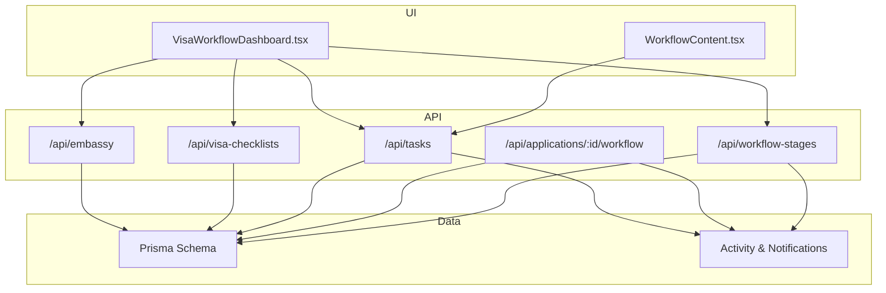
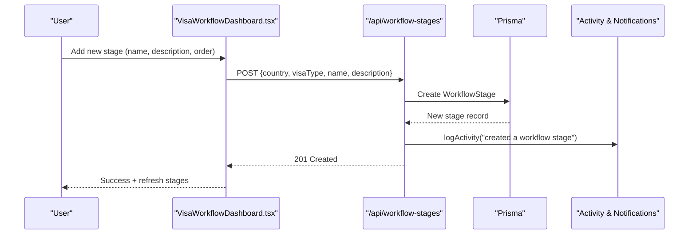
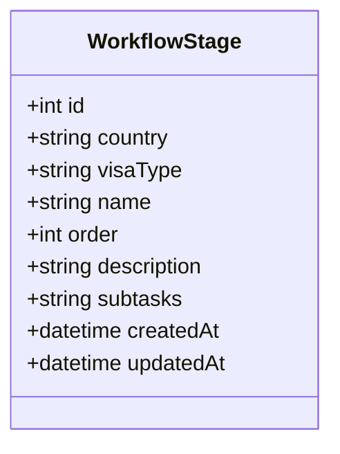
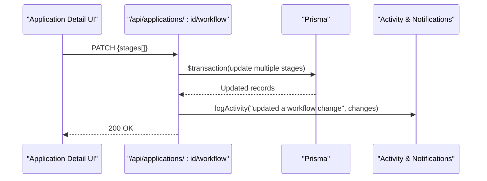
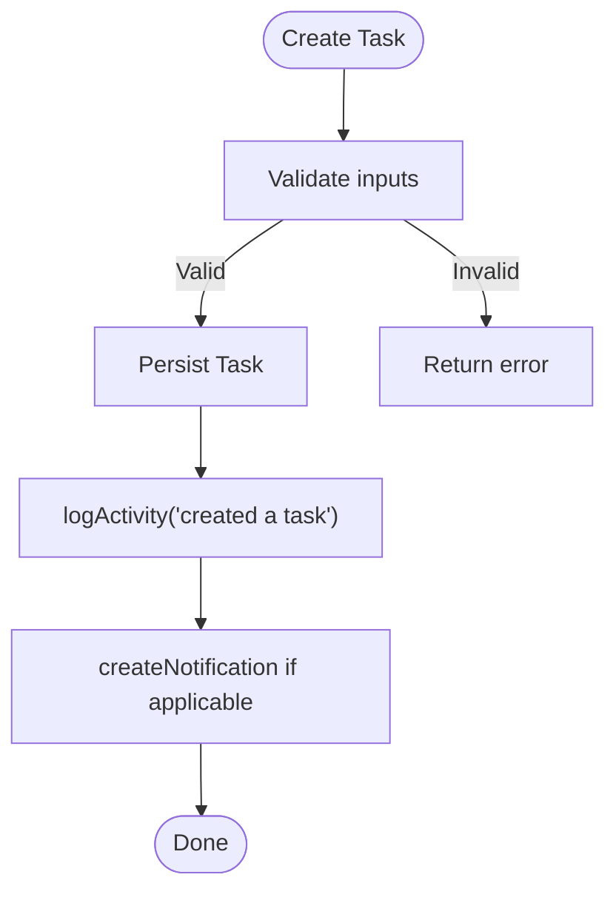
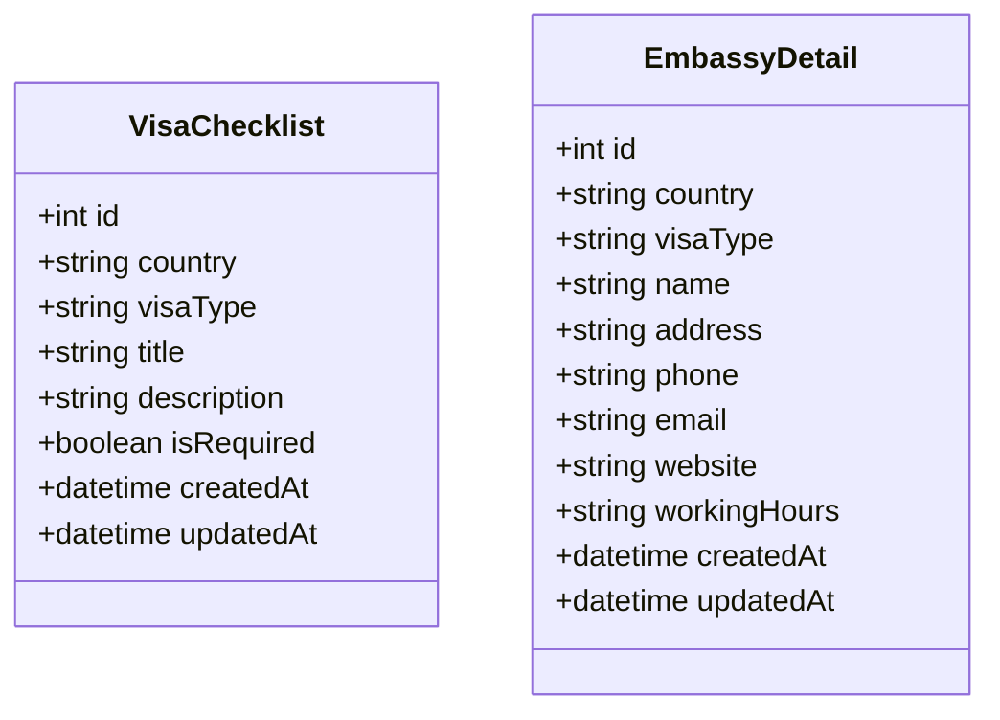
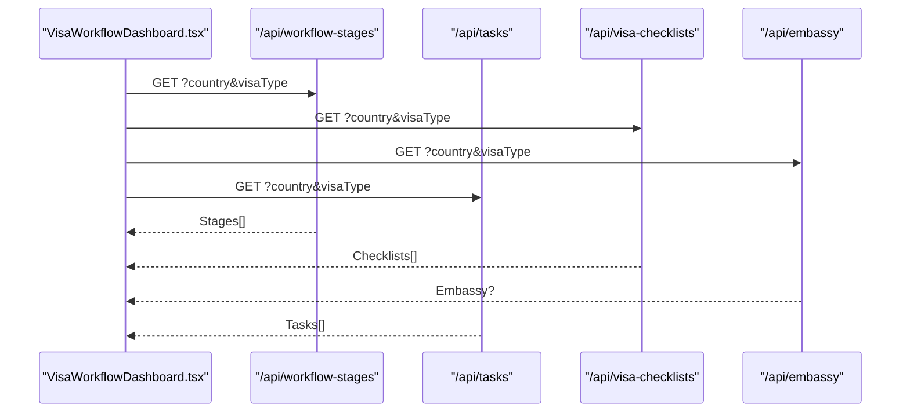
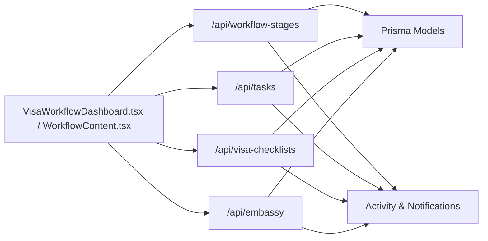

# Workflow Stage Management

<cite>
**Referenced Files in This Document**
- [route.ts](file://src/app/api/workflow-stages/route.ts)
- [route.ts](file://src/app/api/applications/[id]/workflow/route.ts)
- [VisaWorkflowDashboard.tsx](file://src/app/tasks/components/VisaWorkflowDashboard.tsx)
- [WorkflowContent.tsx](file://src/app/tasks/components/WorkflowContent.tsx)
- [route.ts](file://src/app/api/tasks/route.ts)
- [activity.ts](file://src/lib/activity.ts)
- [notifications.ts](file://src/lib/notifications.ts)
- [schema.prisma](file://prisma/schema.prisma)
- [route.ts](file://src/app/api/visa-checklists/route.ts)
- [route.ts](file://src/app/api/embassy/route.ts)
</cite>

## Table of Contents
1. Introduction
2. Project Structure
3. Core Components
4. Architecture Overview
5. Detailed Component Analysis
6. Dependency Analysis
7. Performance Considerations
8. Troubleshooting Guide
9. Conclusion
10. Appendices

## Introduction
This document explains the Workflow Stage Management system for visa applications. It covers how workflows are structured through configurable stages (for example, Document Collection, Application Review, Submission, Processing, Approval), how stage configuration is performed, and how tasks are created and assigned as applications move between stages. It also documents integration points with counselor assignments, deadline handling, automated notifications, stage history tracking, audit trails, and reporting capabilities. Finally, it outlines customization patterns, conditional branching strategies, and escalation rules to handle exceptions or delays.

## Project Structure
The workflow system spans UI components, API routes, and database models:
- Configurable global workflow stages per country and visa type
- Per-application workflow stages that track application-specific progress
- Task management tied to country/visa filters
- Audit logging and notifications on key actions
- Supporting data such as embassy details and visa checklists

**Diagram sources**
- [VisaWorkflowDashboard.tsx:215-234](file://src/app/tasks/components/VisaWorkflowDashboard.tsx#L215-L234)
- [route.ts:1-131](file://src/app/api/workflow-stages/route.ts#L1-L131)
- [route.ts:1-193](file://src/app/api/applications/[id]/workflow/route.ts#L1-L193)
- [route.ts:1-142](file://src/app/api/tasks/route.ts#L1-L142)
- [route.ts:1-128](file://src/app/api/visa-checklists/route.ts#L1-L128)
- [route.ts:1-105](file://src/app/api/embassy/route.ts#L1-L105)
- [schema.prisma:411-629](file://prisma/schema.prisma#L411-L629)
- [activity.ts:60-114](file://src/lib/activity.ts#L60-L114)
- [notifications.ts:1-41](file://src/lib/notifications.ts#L1-L41)

**Section sources**
- [VisaWorkflowDashboard.tsx:215-234](file://src/app/tasks/components/VisaWorkflowDashboard.tsx#L215-L234)
- [route.ts:1-131](file://src/app/api/workflow-stages/route.ts#L1-L131)
- [route.ts:1-193](file://src/app/api/applications/[id]/workflow/route.ts#L1-L193)
- [route.ts:1-142](file://src/app/api/tasks/route.ts#L1-L142)
- [schema.prisma:411-629](file://prisma/schema.prisma#L411-L629)

## Core Components
- Global workflow stages: Define reusable stages per country and visa type, including name, order, description, and subtasks.
- Application workflow stages: Track per-application progression with ordered stages and subtasks.
- Tasks: Create, update, filter, and assign tasks by country and visa type; include due dates and priority.
- Checklists and Embassy details: Support required documents and embassy information per country/visa.
- Activity and notifications: Log changes and create notifications for important actions.

Key responsibilities:
- Configure and manage workflow stages globally and per application
- Manage tasks and their lifecycle
- Provide supporting reference data (checklists, embassy)
- Ensure auditability via activity logs and notifications

**Section sources**
- [route.ts:1-131](file://src/app/api/workflow-stages/route.ts#L1-L131)
- [route.ts:1-193](file://src/app/api/applications/[id]/workflow/route.ts#L1-L193)
- [route.ts:1-142](file://src/app/api/tasks/route.ts#L1-L142)
- [route.ts:1-128](file://src/app/api/visa-checklists/route.ts#L1-L128)
- [route.ts:1-105](file://src/app/api/embassy/route.ts#L1-L105)
- [activity.ts:60-114](file://src/lib/activity.ts#L60-L114)
- [notifications.ts:1-41](file://src/lib/notifications.ts#L1-L41)
- [schema.prisma:411-629](file://prisma/schema.prisma#L411-L629)

## Architecture Overview
The system uses a Next.js API layer backed by Prisma. The UI composes dashboards and forms to configure stages, manage tasks, and view checklists and embassy info. All write operations log activities and may trigger notifications.

**Diagram sources**
- [VisaWorkflowDashboard.tsx:435-455](file://src/app/tasks/components/VisaWorkflowDashboard.tsx#L435-L455)
- [route.ts:30-65](file://src/app/api/workflow-stages/route.ts#L30-L65)
- [activity.ts:60-114](file://src/lib/activity.ts#L60-L114)

**Section sources**
- [VisaWorkflowDashboard.tsx:435-455](file://src/app/tasks/components/VisaWorkflowDashboard.tsx#L435-L455)
- [route.ts:30-65](file://src/app/api/workflow-stages/route.ts#L30-L65)
- [activity.ts:60-114](file://src/lib/activity.ts#L60-L114)

## Detailed Component Analysis

### Global Workflow Stages (per Country and Visa Type)
- Purpose: Define reusable processing stages for each country/visa combination.
- Capabilities:
  - List stages filtered by country and visa type
  - Create, update, delete stages
  - Store subtasks as JSON within each stage
  - Order stages numerically
  - Log all changes to activity and generate notifications for creation/deletion

**Diagram sources**
- [schema.prisma:619-629](file://prisma/schema.prisma#L619-L629)

**Section sources**
- [route.ts:1-131](file://src/app/api/workflow-stages/route.ts#L1-L131)
- [schema.prisma:619-629](file://prisma/schema.prisma#L619-L629)

### Application Workflow Stages (Per Application)
- Purpose: Track an individual application’s progress with ordered stages and subtasks.
- Capabilities:
  - Fetch stages for a specific application
  - Create new stages per application
  - Batch-update multiple stages atomically
  - Delete a stage and re-order remaining stages
  - Log changes and target context (student/course)

**Diagram sources**
- [route.ts:72-148](file://src/app/api/applications/[id]/workflow/route.ts#L72-L148)
- [activity.ts:60-114](file://src/lib/activity.ts#L60-L114)

**Section sources**
- [route.ts:1-193](file://src/app/api/applications/[id]/workflow/route.ts#L1-L193)

### Task Assignment System
- Purpose: Create and manage tasks associated with workflows by country and visa type.
- Capabilities:
  - Filter tasks by country and visa type
  - Create tasks with title, description, status, priority, due date, and assignee
  - Update task fields and log changes
  - Delete tasks with activity logging

**Diagram sources**
- [route.ts:44-79](file://src/app/api/tasks/route.ts#L44-L79)
- [activity.ts:60-114](file://src/lib/activity.ts#L60-L114)
- [notifications.ts:1-41](file://src/lib/notifications.ts#L1-L41)

**Section sources**
- [route.ts:1-142](file://src/app/api/tasks/route.ts#L1-L142)
- [activity.ts:60-114](file://src/lib/activity.ts#L60-L114)
- [notifications.ts:1-41](file://src/lib/notifications.ts#L1-L41)

### Visa Checklists and Embassy Details
- Purpose: Provide required document lists and embassy information per country/visa.
- Capabilities:
  - CRUD for checklist items with required flags
  - Retrieve/update embassy details per country/visa
  - Activity logging for all changes

**Diagram sources**
- [schema.prisma:608-629](file://prisma/schema.prisma#L608-L629)

**Section sources**
- [route.ts:1-128](file://src/app/api/visa-checklists/route.ts#L1-L128)
- [route.ts:1-105](file://src/app/api/embassy/route.ts#L1-L105)
- [schema.prisma:608-629](file://prisma/schema.prisma#L608-L629)

### UI Orchestration and Subtask Management
- Purpose: Provide a visual pipeline for configuring stages, managing subtasks, and viewing tasks/checklists/embassy info.
- Capabilities:
  - Load and display workflow stages for selected country/visa
  - Add/edit/delete stages and subtasks
  - Generate PDF checklists
  - View and manage tasks filtered by country/visa

**Diagram sources**
- [VisaWorkflowDashboard.tsx:169-234](file://src/app/tasks/components/VisaWorkflowDashboard.tsx#L169-L234)
- [route.ts:8-28](file://src/app/api/workflow-stages/route.ts#L8-L28)
- [route.ts:7-27](file://src/app/api/visa-checklists/route.ts#L7-L27)
- [route.ts:7-26](file://src/app/api/embassy/route.ts#L7-L26)
- [route.ts:19-42](file://src/app/api/tasks/route.ts#L19-L42)

**Section sources**
- [VisaWorkflowDashboard.tsx:169-234](file://src/app/tasks/components/VisaWorkflowDashboard.tsx#L169-L234)

## Dependency Analysis
- UI depends on API endpoints for stages, tasks, checklists, and embassy data.
- APIs depend on Prisma models for persistence.
- Write operations depend on activity logging and optional notification creation.
- Data models define relationships and constraints for workflow stages, tasks, checklists, and embassy details.

**Diagram sources**
- [VisaWorkflowDashboard.tsx:169-234](file://src/app/tasks/components/VisaWorkflowDashboard.tsx#L169-L234)
- [route.ts:1-131](file://src/app/api/workflow-stages/route.ts#L1-L131)
- [route.ts:1-142](file://src/app/api/tasks/route.ts#L1-L142)
- [route.ts:1-128](file://src/app/api/visa-checklists/route.ts#L1-L128)
- [route.ts:1-105](file://src/app/api/embassy/route.ts#L1-L105)
- [activity.ts:60-114](file://src/lib/activity.ts#L60-L114)
- [notifications.ts:1-41](file://src/lib/notifications.ts#L1-L41)
- [schema.prisma:411-629](file://prisma/schema.prisma#L411-L629)

**Section sources**
- [route.ts:1-131](file://src/app/api/workflow-stages/route.ts#L1-L131)
- [route.ts:1-142](file://src/app/api/tasks/route.ts#L1-L142)
- [route.ts:1-128](file://src/app/api/visa-checklists/route.ts#L1-L128)
- [route.ts:1-105](file://src/app/api/embassy/route.ts#L1-L105)
- [activity.ts:60-114](file://src/lib/activity.ts#L60-L114)
- [notifications.ts:1-41](file://src/lib/notifications.ts#L1-L41)
- [schema.prisma:411-629](file://prisma/schema.prisma#L411-L629)

## Performance Considerations
- Batch updates: Use transactional batch updates when reordering or updating multiple stages to minimize round trips and ensure consistency.
- Filtering: Always filter by country and visa type to reduce dataset size.
- Pagination: For large task sets, consider adding pagination to task queries.
- Caching: Cache static references like embassy details and checklists per country/visa where appropriate.
- Logging overhead: Activity logging is lightweight but should be considered under high-throughput scenarios.

[No sources needed since this section provides general guidance]

## Troubleshooting Guide
Common issues and resolutions:
- Missing parameters: Ensure country and visaType are provided for workflow-stage and checklist endpoints.
- Unauthorized access: Verify session/token validity before calling protected endpoints.
- Validation errors: Confirm required fields (e.g., stage name, task title) are present.
- Database errors: Check Prisma schema alignment and connection settings.
- Activity logging failures: Inspect logger and notification service for errors.

**Section sources**
- [route.ts:14-28](file://src/app/api/workflow-stages/route.ts#L14-L28)
- [route.ts:13-27](file://src/app/api/visa-checklists/route.ts#L13-L27)
- [route.ts:44-79](file://src/app/api/tasks/route.ts#L44-L79)
- [activity.ts:60-114](file://src/lib/activity.ts#L60-L114)
- [notifications.ts:1-41](file://src/lib/notifications.ts#L1-L41)

## Conclusion
The Workflow Stage Management system provides a flexible, auditable framework for managing visa application processes across countries and visa types. It supports configurable stages, per-application tracking, task assignment, and integrated checklists and embassy information. Activity logging and notifications ensure traceability and awareness. With clear separation of concerns and robust API design, teams can customize workflows, implement conditional logic, and set up escalation rules to handle exceptions and delays effectively.

[No sources needed since this section summarizes without analyzing specific files]

## Appendices

### Stage Configuration Process
- Define stages per country and visa type with names, descriptions, and order.
- Attach subtasks to each stage to capture granular steps.
- Use the dashboard to add, edit, and reorder stages; changes are logged.

**Section sources**
- [VisaWorkflowDashboard.tsx:435-455](file://src/app/tasks/components/VisaWorkflowDashboard.tsx#L435-L455)
- [route.ts:30-65](file://src/app/api/workflow-stages/route.ts#L30-L65)

### Task Creation and Assignment
- Create tasks with titles, priorities, due dates, and assignees.
- Filter tasks by country and visa type to focus workstreams.
- Update statuses and log changes automatically.

**Section sources**
- [route.ts:44-114](file://src/app/api/tasks/route.ts#L44-L114)

### Integration with Counselor Assignments and Deadlines
- Counselor assignment is managed in related modules; tasks support assignee fields and due dates to enforce deadlines.
- Combine counselor assignment with task due dates to drive follow-ups and escalations.

**Section sources**
- [schema.prisma:522-538](file://prisma/schema.prisma#L522-L538)

### Automated Notifications
- Key actions (create, invite, delete) trigger notifications via the activity logging utility.
- Notifications are persisted and can be surfaced in the UI.

**Section sources**
- [activity.ts:98-114](file://src/lib/activity.ts#L98-L114)
- [notifications.ts:1-41](file://src/lib/notifications.ts#L1-L41)

### Stage History Tracking and Audit Trails
- All stage and task mutations log changes with actor identification and diffed field changes.
- Use the activity log to review who changed what and when.

**Section sources**
- [activity.ts:24-45](file://src/lib/activity.ts#L24-L45)
- [activity.ts:60-114](file://src/lib/activity.ts#L60-L114)
- [route.ts:67-101](file://src/app/api/workflow-stages/route.ts#L67-L101)
- [route.ts:81-114](file://src/app/api/tasks/route.ts#L81-L114)

### Customization Patterns and Conditional Branching
- Pattern: Define multiple stages per country/visa; use subtasks to model detailed steps.
- Conditional branching: Implement client-side or server-side logic to skip or insert stages based on application attributes (e.g., visa type, country rules).
- Escalation rules: Set due dates and monitor overdue tasks; escalate via notifications or manual intervention when thresholds are exceeded.

[No sources needed since this section provides conceptual guidance]

### Reporting Capabilities
- Use task filters by country/visa to generate reports on workload and completion rates.
- Leverage activity logs for audit reports on changes to stages and tasks.
- Export checklists as PDFs for distribution to applicants.

**Section sources**
- [VisaWorkflowDashboard.tsx:326-433](file://src/app/tasks/components/VisaWorkflowDashboard.tsx#L326-L433)
- [route.ts:19-42](file://src/app/api/tasks/route.ts#L19-L42)
- [activity.ts:60-114](file://src/lib/activity.ts#L60-L114)